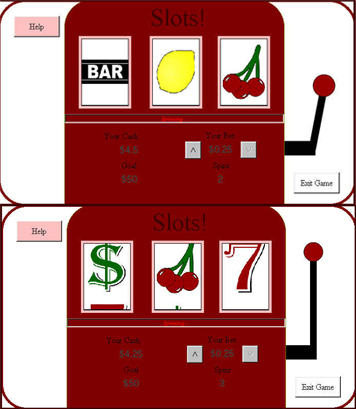



## Fully Animated Slot Machine\(No timers\)

### Description

Smooth and full animation using bitblt without the use of timers. Also demonstrates various other graphics-related APIs. IMHO one of the best, if not the best, slot machine on PSC ^^. (Fully Commented) Uses APIs such as Bitblt, LoadImageA, CreateCompatibleDC etc... (I had to resubmit because I included the wrong module in previous submission)
 
### More Info
 
mdlTime.bas and it's usage throughout the project was added later on. E-mail for any questions/comments at s1011112@rogers.com

             |
---                |---
**Submitted On**   |2001-12-05 18:15:48
**By**             |[Chan Park](https://github.com/Planet-Source-Code/PSCIndex/blob/master/ByAuthor/chan-park.md)
**Level**          |Intermediate
**User Rating**    |5.0 (15 globes from 3 users)
**Compatibility**  |VB 6\.0
**Category**       |[Games](https://github.com/Planet-Source-Code/PSCIndex/blob/master/ByCategory/games__1-38.md)
**World**          |[Visual Basic](https://github.com/Planet-Source-Code/PSCIndex/blob/master/ByWorld/visual-basic.md)
**Archive File**   |[Fully\_Anim396731252001\.zip](https://github.com/Planet-Source-Code/chan-park-fully-animated-slot-machine-no-timers__1-29496/archive/master.zip)

